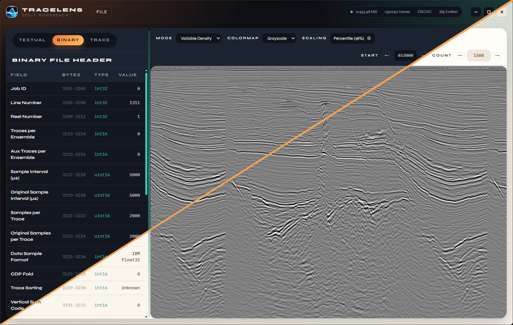

# TraceLens Seismic Data Viewer

A modern, cross-platform desktop application for viewing and inspecting SEG-Y seismic data files.


Parihaka 3D seismic data courtesy of New Zealand Petroleum and Minerals (NZPM) / New Zealand Crown
Minerals, supplied as a public dataset.

## Features

- **SEG-Y Rev 0 Parsing** - Textual (EBCDIC/ASCII), binary, and trace headers with multiple sample formats
- **Spec-Driven Header Inspection** - Binary and trace header tables from the embedded Rev 0 JSON spec
- **Trace Visualization** - Variable density, wiggle, and combined renders with colormaps and amplitude scaling
- **Interactive Viewport** - Trace range controls, pan/zoom, and resizable panels
- **Performance-Focused I/O** - Memory-mapped reads with on-demand trace loading and async rendering

## Upcoming / Future Features

- **Multi-Revision Support** - SEG-Y Rev 1, Rev 2.0, and Rev 2.1 compatibility
- **Custom Header Definitions** - User-defined field specs and overrides
- **Cloud Integration** - Read files from S3, GCS, Azure, and HTTPS

## Tech Stack

**Backend**

- Rust with Tokio for async operations
- Tauri for native desktop integration
- Efficient binary parsing with `byteorder`

**Frontend**

- React 19 with TypeScript
- Vite for fast development and builds
- Zustand for state management
- Tailwind CSS and shadcn/ui components for styling

## Getting Started

### Prerequisites

- [Rust](https://rustup.rs/) (1.77.2+)
- [Node.js](https://nodejs.org/) (18+)

### Installation

```bash
# Clone the repository
git clone <repository-url>
cd tracelens

# Install dependencies
npm install

# Run in development mode
npm run tauri dev
```

### Build

```bash
# Build for production
npm run tauri build
```

## Development

```bash
# Run frontend dev server
npm run dev

# Format and lint frontend code
npm run format
npm run lint

# Format and lint Rust code
cd src-tauri && cargo fmt
cd src-tauri && cargo clippy

# Run Rust tests
cd src-tauri && cargo test
```

## Platform Support

- Windows
- macOS
- Linux

## License

Licensed under either of

- Apache License, Version 2.0 (see `LICENSE-APACHE`)
- MIT license (see `LICENSE-MIT`)

at your option.
