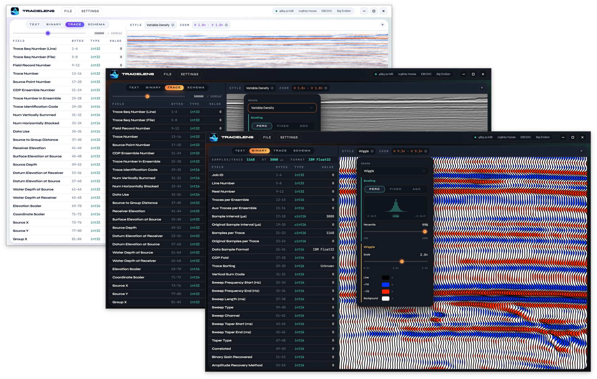

# TraceLens Seismic Data Viewer

A modern, cross-platform desktop application for viewing and inspecting SEG-Y seismic data files.


Parihaka 3D seismic data courtesy of New Zealand Petroleum and Minerals (NZPM) / New Zealand Crown
Minerals, supplied as a public dataset.

## Features

- **Multi-Revision SEG-Y Parsing** - Automatic revision detection (Rev 0 / Rev 1) with manual override when detection is ambiguous
- **Schema-Driven Header Inspection** - Binary and trace header tables loaded from embedded JSON specs per revision; schema metadata (field counts, byte ranges) visible in the Schema tab
- **Dynamic Header Parsing** - Spec-driven field extraction at runtime — no hardcoded struct rewrites needed for new revisions
- **Spec Validation** - All embedded specs are validated at startup for overlapping byte ranges, duplicate keys, and structural integrity
- **Trace Visualization** - Variable density, wiggle, and combined renders with colormaps and amplitude scaling
- **Interactive Viewport** - Trace range controls, pan/zoom, and resizable panels
- **Performance-Focused I/O** - Memory-mapped reads with on-demand trace loading and async rendering
- **Remote File Support** - Load SEG-Y files from local disk, S3, GCS, Azure Blob Storage, and HTTPS endpoints
- **GPU Accelerated Rendering** - Extremely fast WebGL-based rendering for up to tens of thousands of traces when
- **Tiled Rendering** - Efficient canvas rendering with viewport-based tile loading for smooth interaction
- **Settings Persistence** - User preferences saved between sessions

## Upcoming / Future Features

- **SEG-Y Rev 2.0 / Rev 2.1 Support** - Extended header and variable trace length parsing
- **Custom Header Definitions** - User-defined field specs and overrides with save/load workflows

## Tech Stack

**Backend**

- Rust with Tokio for async operations
- Tauri for native desktop integration
- Efficient binary parsing with `byteorder`
- Memory-mapped file I/O for local files
- Cloud storage integrations (S3, GCS, Azure Blob Storage, HTTP)

**Frontend**

- React 19 with TypeScript
- Vite for fast development and builds
- Zustand for state management
- Tailwind CSS and shadcn/ui components for styling
- Lucide React for icons
- Tauri plugin system for dialogs, processes, and updates

## Getting Started

### Prerequisites

- [Rust](https://rustup.rs/) (1.94.1+)
- [Node.js](https://nodejs.org/) (20+)

### Installation

```bash
# Clone the repository
git clone <repository-url>
cd tracelens

# Install dependencies
npm install

# Run in development mode
npm run tauri dev
```

### Build

```bash
# Build for production
npm run tauri build
```

## Development

```bash
# Run frontend dev server
npm run dev

# Format and lint frontend code
npm run format
npm run lint

# Format and lint Rust code
cd src-tauri && cargo fmt
cd src-tauri && cargo clippy

# Run Rust tests
cd src-tauri && cargo test
```

## Platform Support

- Windows
- macOS
- Linux

## License

Licensed under either of

- Apache License, Version 2.0 (see `LICENSE-APACHE`)
- MIT license (see `LICENSE-MIT`)

at your option.
